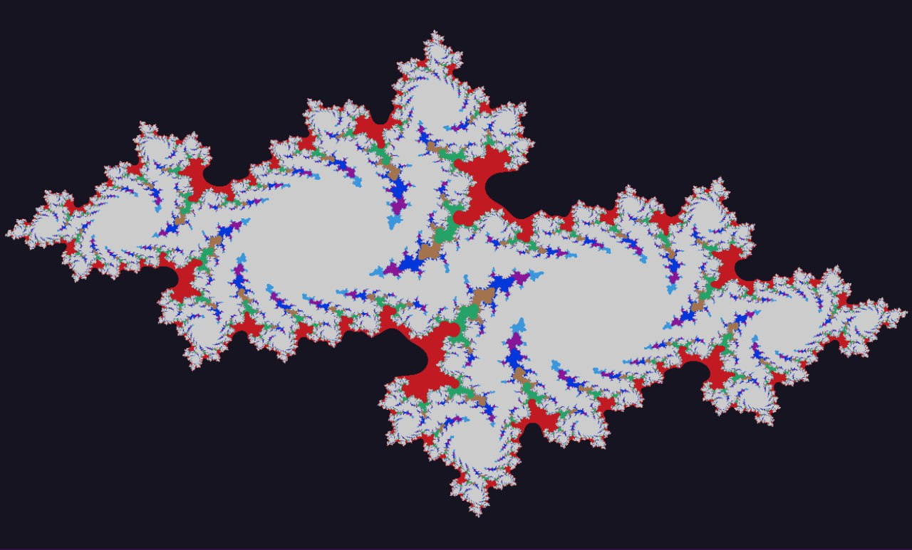
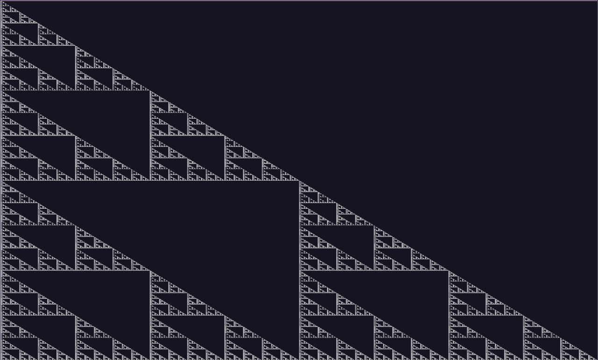

<h1 align="center">
  🌠 FractalGenerator — Haskell CLI Fractal Explorer
</h1>

<p align="center">
  <em>Terminal‑native playground for exploring mathematical fractals with type‑safe Haskell elegance.</em>
</p>

<p align="center">
  
  
  
  
  
</p>

---

## Table of Contents

1. ❓ [Why FractalGenerator?](#why-fractalgenerator)
2. ✨ [Features](#features)
3. 🖼️ [Screenshots](#screenshots)
4. 🚀 [Getting Started](#getting-started)
5. 🗂️ [Project Layout](#project-layout)
6. 🧩 [Modules Breakdown](#modules-breakdown)
7. 🔧 [Extending the Project](#extending-the-project)
8. 📚 [Key Dependencies](#key-dependencies)
9. 📄 [License](#license)
10. 📬 [Contact](#contact)

---

## ❓ Why FractalGenerator?

> *“Mathematics, meet ANSI.”*
>
> — some Haskell enjoyer, probably.

* 🌌 **Math eye‑candy.** Render classic sets in seconds straight in your terminal.
* ⛑️ **Type‑safe by design.** Strong static types keep your exploration crash‑free.
* 🏗️ **Hack‑friendly.** Small, readable codebase — perfect for adding your own fractals.

---

## ✨ Features

|                              | Description                                                                  |
| ---------------------------- | ---------------------------------------------------------------------------- |
| 🎮 **Interactive UI**        | ASCII‑art splash screen + guided menus (no cryptic flags).                   |
| 🌌 **Multi‑fractal support** | Mandelbrot Set, Julia Set, Sierpinski Triangle — each with tweakable params. |
| 🖥️ **Dynamic resize**       | Adapts to current terminal size via `terminal-size`.                         |
| 🌈 **ANSI colours**          | Crisp coloured output powered by `ansi-terminal`.                            |
| 🧪 **Test‑driven**           | `hspec` suite keeps renders & helpers honest.                                |
| ⚡ **Parallel rendering**     | Leverages Haskell runtime for snappier Mandelbrots.                          |

---

## 🖼️ Screenshots

<p align="center">
  
  
  
  
</p>

> *All images captured straight from the terminal; no post‑processing.*

---

## 🚀 Getting Started

### 0. Prerequisites

| Tool      | Tested version | Notes                      |
| --------- | -------------- | -------------------------- |
| **GHC**   | 9.6+           | via `ghcup` or Stack       |
| **Stack** | `2.15.5`       | easiest way to build & run |

### 1. Clone

```bash
git clone https://github.com/your-user/fractal-generator.git
cd fractal-generator
```

### 2. Run the app

```bash
stack run        # follow on‑screen menus to explore!
```

### 3. Run tests (optional)

```bash
stack test
```

---

## 🗂️ Project Layout

```text
fractal-generator/
├── app/                 # Main entry point
│   └── Main.hs
├── src/
│   ├── AsciiRenderer.hs
│   ├── Types.hs
│   ├── Utils.hs
│   ├── CLI/
│   │   └── UI.hs
│   └── Fractals/
│       ├── Generator.hs
│       └── Generator/
│           ├── Mandelbrot.hs
│           ├── Julia.hs
│           └── Sierpinski.hs
├── test/
│   └── Spec.hs
├── screenshots/         # PNG/JPG captures used in README
└── README.md            # you’re reading it
```

---

## 🧩 Modules Breakdown

| Module                 | Purpose                              |
| ---------------------- | ------------------------------------ |
| `CLI.UI`               | Menus, prompts, YAML‑like ASCII logo |
| `Fractals.Generator.*` | Math / iteration logic per fractal   |
| `AsciiRenderer`        | Maps iteration counts → RGB pairs    |
| `Utils`                | Terminal size + misc helpers         |
| `Types`                | Shared newtypes & records            |

---

## 🔧 Extending the Project

**Add your own fractal in 4 steps:**

1. `src/Fractals/Generator/<YourFractal>.hs` — implement `generate`.
2. Extend the `FractalChoice` ADT in `Generator.hs` + pattern‑match.
3. Add a menu entry in `displayFractalMenu` inside `CLI.UI`.
4. Drop a screenshot in `screenshots/` and send a PR. 🚀

Need tweaks? Iteration depth, colour palette, or viewport maths live right next to each fractal module.

---

## 📚 Key Dependencies

| Package                                                              | Why                        |
| -------------------------------------------------------------------- | -------------------------- |
| [`ansi-terminal`](https://hackage.haskell.org/package/ansi-terminal) | Colourful output           |
| [`terminal-size`](https://hackage.haskell.org/package/terminal-size) | Window resize detection    |
| [`mtl`](https://hackage.haskell.org/package/mtl)                     | Reader / State niceties    |
| [`parallel`](https://hackage.haskell.org/package/parallel)           | Fork/Join for faster plots |
| [`hspec`](https://hackage.haskell.org/package/hspec)                 | Test framework             |

---

## 📄 License

GNU GPL‑3.0 © 2023‑present — free to fork, tweak, and generate your own fractal universe.

> *Found a bug? File an issue — I’m keeping an eye on them and happy to fix!* 🐛
