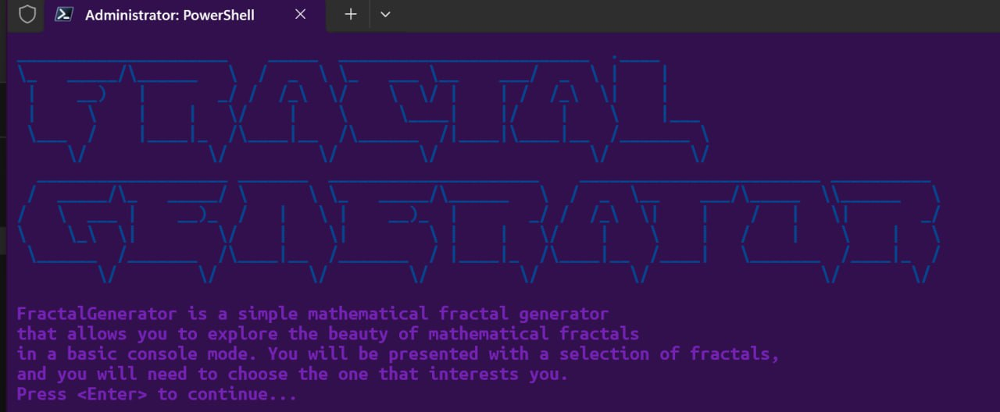
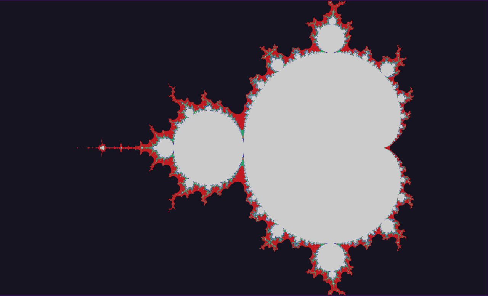
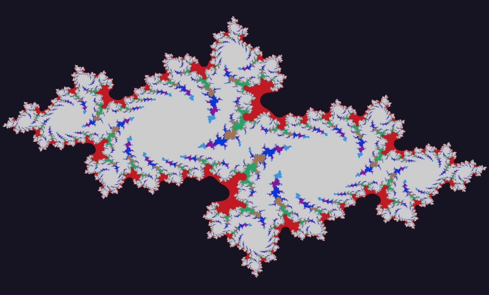
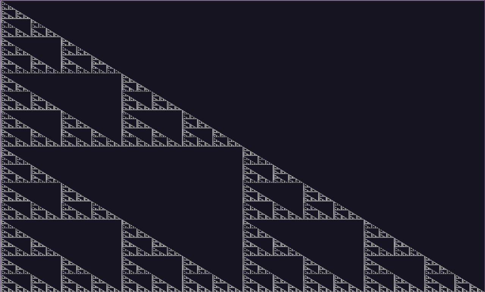

# FractalGenerator

A small Haskell CLI that draws classic mathematical fractals straight in your
terminal. Built on top of `ansi-terminal`, `parallel` and `hspec`.

## Features

* Mandelbrot Set, Julia Set, Sierpinski Triangle — each with tweakable params.
* Adapts to the current terminal size via `terminal-size`.
* Coloured output powered by `ansi-terminal`.
* `hspec` test suite keeps renders & helpers honest.
* Parallel rendering with `parList` for snappier Mandelbrots.

## Screenshots

<p align="center">
  
  
  
  
</p>

## Getting Started

Requires GHC 9.6+ and Stack 2.15+.

```bash
stack build
stack run
```

Follow the on-screen menus to pick a fractal. Maximize the terminal window and
shrink the font for the best results.

```bash
stack test
```

## Project Layout

```text
fractal-generator/
├── app/Main.hs
├── src/
│   ├── AsciiRenderer.hs
│   ├── Types.hs
│   ├── Utils.hs
│   ├── CLI/UI.hs
│   └── Fractals/
│       ├── Generator.hs
│       └── Generator/{Mandelbrot.hs, Julia.hs, Sierpinski.hs}
├── test/Spec.hs
└── screenshots/
```

## Modules Breakdown

| Module                 | Purpose                              |
| ---------------------- | ------------------------------------ |
| `CLI.UI`               | Menus, prompts, ASCII logo           |
| `Fractals.Generator.*` | Math / iteration logic per fractal   |
| `AsciiRenderer`        | Maps iteration counts → RGB pairs    |
| `Utils`                | Terminal size + misc helpers         |
| `Types`                | Shared newtypes & records            |

## Extending

1. `src/Fractals/Generator/<YourFractal>.hs` — implement `generate`.
2. Extend the `FractalChoice` ADT in `Generator.hs` + pattern-match.
3. Add a menu entry in `displayFractalMenu` inside `CLI.UI`.
4. Drop a screenshot in `screenshots/`.

## License

GPL — see the LICENSE file for the full text.
